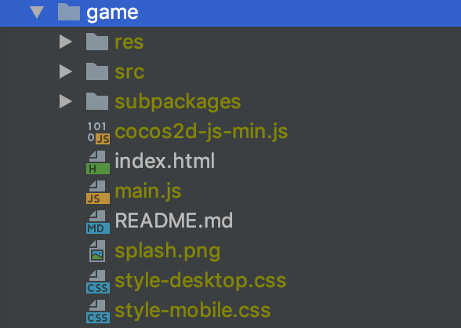

# CocosCreatorForDeskApp
如果你的游戏时使用cocos creator开发制作的,并且希望能够发布为桌面应用,那么该解决方案一定能帮助到您!

该解决方案,基于Electron,轻松将cocos creator发布到任何桌面,使用该解决方案的好处是,再也不用去踩发布原生桌面应用的坑了!

为此,您需要注意,相比原生桌面应用,该解决方案最终游戏包体会增加50~70M不等,如果您特别在意游戏安装包体积,那么,请慎重考虑!

## 使用说明
- 安装依赖`npm install`
- 运行: `npm run app` 

## 打包说明

### 打包前的准备工作

- 使用CocosCreator构建出一份web版本的游戏
- 将构建的web游戏拷贝到game目录,game目录文件示例

本项目采用的是`electron-builder`打包

- 全局安装`electron-builder`依赖: `npm install -g electron-builder`
- 打包:
    - win: `npm run pack-win`
    - mac: `npm run pack-mac`

## 后续开发功能
- 请查看相关issues
- 欢迎追加issues

欢迎加入CocosCreator插件交流群(224756137)
 
一起学习,一起进步!

